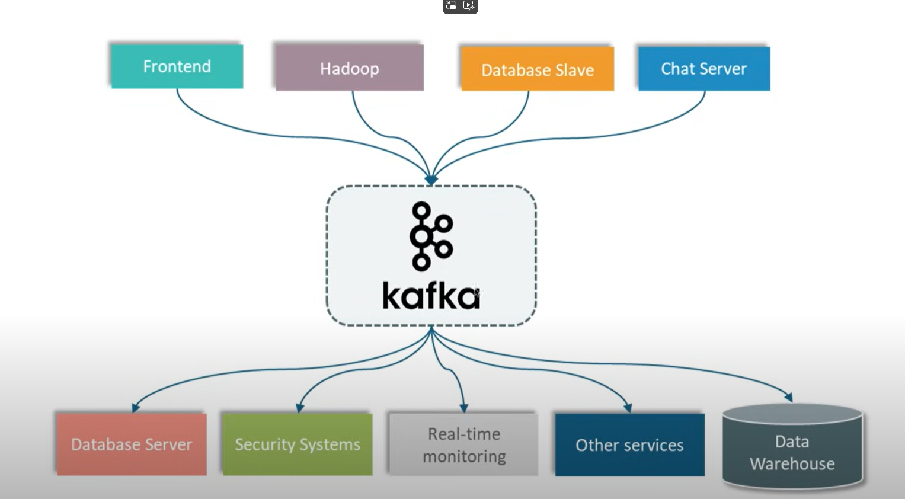

# Introduction

## What is kafka and why we need it?

Apache kafka is an open-source distributed event streaming platform. 

Event Streaming implies to different task:
1. Creating Real-time Stream
2. Processing Real-time Stream

Distributed means you can have different kafka servers, if one server goes down; another one comes and take its place. 

We need kafka to not lose data in case our server is currently not responding.

I can have different applications:
 - Frontend
 - Hadoop
 - Database Slave
 - Chat Server
 - Database Server
 - Security Systems
 - Real Time monitoring
 - Data Warehouse

Every one of them need to communicate with each other. The data format can vary a lot (json, plaintext, html etc...), the connection type can
vary a lot as well (grpc, udp, rest...) and in the end you have to maintain a lot of number of connections. How to manage? Using kafka in the middle

So let's see some names that kafka use:

The *publisher* send a *message/event* to the *message broker*. The *subscriber* will go to that particular message broker and take the message. 

## Kafka components and Internal Architecture

The following are the components kafka is made of:
- Producer
- Consumer
- Broker
- Cluster
- Topic
- Partitions
- Offset
- Consumer Groups
- Zookeeper

>> The kafka broker is nothing but just a server. In simple word, A broker is just an intermediate entity that helps in message exchanges 
> between a producer and a consumer

The Kafka cluster is the group of all the brokers. Generally you install a broker per server so a kafka cluster is similar to a server cluster.

If you then image the broker as a database where message is placed waiting to be consumed, a topic is like a table of that database.
Is a way to categorize different types of messages. We can tell the consumer to listen to particular topic, the same way you do a sql select query 

    select * from topic_1;

And get all the message you need.

>> The kafka topic specifies the category of the message or the classification of the message. Listeners can then just respond to the messages
> that belong to the topics they are listening on.

Like sql table even topic can be partitioned. Since there can be millions of messages you have to store partitions helps you in that way
Partitions will give you better performance and availability. In the configuration of a topic we can specify the max number a topic partitions
can have. 

As soon as a message is stored in a partition a specific number is assigned to that message. This is called *offset*. Consider that the offset is 
unique per partition. So you can have the same offset in different partitions. Offset are useful to know how many message a consumer has consumed. For example,
consider that a consumer after reading 4 message went down. Kafka save that the particular consumer has consumed messages with offset 0,1,2,3. So
when the consumer will be up again, kafka will send him the message with offsets: 4,5 not 0,1,2,3 since this 4 messages are already be consumed by that consumer.

Now who listen to these partitions? If we have a single consumer who read all the messages for all the partitions, this could lay to performance issue. 
It would be wise to have, if you have 3 partitions, 3 consumer. I then can group all 3 consumer in a consumer group. Now I can split the workload between this 
consumers. The consumer register to a topic but every consumer can listen to any partitions. So the coordinator is responsible to match consumers with partitions.

>> If you have 4 consumer for 3 partitions, the 4th consumer will simply sit and wait, because the coordinator cannot match it to any partitions. In other word the coordinator
> can assign multiple partitions to a single consumer, but not multiple consumer to a single partitions. Nevertheless, if a consumer goes down consumer
> 4th will get its chance and connect to a partition

### Kafka With and Without Zookeeper

#### 🔹 1. Kafka with Zookeeper (classic architecture)

##### Roles
- **Zookeeper**: distributed configuration and coordination database.
- **Kafka broker**: nodes that manage topics, partitions, and messages.

##### How it works
1. **Metadata** (topics, partitions, ACLs, broker states) is stored in Zookeeper.
2. Zookeeper keeps a list of active brokers.
3. One broker is elected as **controller** via Zookeeper.
4. If a broker fails, the controller reassigns partitions using Zookeeper.
5. Producers and consumers talk to brokers for reads/writes, and brokers fetch metadata from Zookeeper.

📌 **Key points**
- Kafka **cannot** function if Zookeeper is down.
- Scalability and resilience also depend on Zookeeper’s health.
- More complexity: two distributed systems to manage.

---

#### 🔹 2. Kafka without Zookeeper (KRaft mode)

From Kafka 2.8 (beta) and production-ready in 3.5, Zookeeper can be replaced by **KRaft** (**Kafka Raft Metadata mode**).

##### Roles
- **Controller node**: special brokers that store metadata and participate in the Raft consensus.
- **Broker node**: manage topics and messages (can also be controllers in smaller setups).

##### How it works
1. Cluster metadata is no longer in Zookeeper but in an **internal Kafka log** called the *metadata log*.
2. This log is replicated among controllers using the **Raft** consensus algorithm (used by systems like etcd and Consul).
3. When metadata changes are needed (create topic, add partitions, etc.), the request goes to controllers, which append it to the metadata log.
4. Brokers read the metadata log to stay up-to-date with the cluster state.

📌 **Key points**
- No need for an external system like Zookeeper.
- Single consensus protocol (Raft) for both data **and** metadata.
- Easier startup and management (single Kafka cluster).
- Lower latency for admin operations.

---

#### 🔹 Key differences table

| Feature                  | With Zookeeper           | With KRaft (no Zookeeper) |
|--------------------------|--------------------------|---------------------------|
| Extra component          | Yes, Zookeeper cluster   | No                        |
| Where metadata is stored | In Zookeeper             | In Kafka metadata log     |
| Consensus protocol       | Zab (Zookeeper Atomic Broadcast) | Raft                  |
| Operational complexity   | Higher (two systems)     | Lower                     |
| Future support           | Deprecated from 4.0      | Future standard           |

---

💡 **In practice**:
- With **Zookeeper**, Kafka is “dependent” on an external registry and arbitrator.
- With **KRaft**, Kafka is self-managed, metadata lives inside the same ecosystem, and consensus is internal.

#### Different ways to install kafka

We have different versions of Kafka:

- Open Source: Apache kafka
- Commercial distribution: ConfluentInc Kafka
- Managed kafka service: ConfluentInc & AWS

It's a good idea to install also [kafka offset explorer](https://kafkatool.com/download.html) which will help us to monitor our kafka messaging systems. To install kafka we need to things:
- Kafka 
- Zookeeper

*I will use the opensource distribution Apache Kafka so without zookeeper*

#### Kafka KRaft Configuration Properties Explained

##### 1. Node & Roles
`KAFKA_NODE_ID: 1`
- Unique ID for the Kafka node in the cluster.
- Required in **KRaft mode** (without Zookeeper).
- Must be unique for each broker in the cluster.

`KAFKA_PROCESS_ROLES: broker,controller`
- Defines the roles for this node:
    - **broker** → handles topics and partitions.
    - **controller** → manages the metadata log and Raft consensus.
- In larger clusters, you can separate these roles (some nodes only controllers, others only brokers).

---

##### 2. Network & Listeners
`KAFKA_LISTENERS: PLAINTEXT://localhost:9092,CONTROLLER://localhost:9093`
- Interfaces and ports where Kafka listens for connections.
- `PLAINTEXT://localhost:9092` → for producers/consumers.
- `CONTROLLER://localhost:9093` → for controller-to-controller communication (Raft).

`KAFKA_ADVERTISED_LISTENERS: 'PLAINTEXT://localhost:9092,PLAINTEXT_HOST://localhost:29092'`
- Addresses advertised to clients.
- `PLAINTEXT://localhost:9092` → for local connections.
- `PLAINTEXT_HOST://localhost:29092` → for connections from outside Docker (host machine).

`KAFKA_CONTROLLER_LISTENER_NAMES: CONTROLLER`
- Specifies which listener is used for controller communication.

`KAFKA_LISTENER_SECURITY_PROTOCOL_MAP: CONTROLLER:PLAINTEXT,PLAINTEXT:PLAINTEXT,PLAINTEXT_HOST:PLAINTEXT`
- Maps each listener to a security protocol.
- All are set to `PLAINTEXT` (no SSL or SASL).

---

##### 3. KRaft Consensus
`KAFKA_CONTROLLER_QUORUM_VOTERS: 1@localhost:9093`
- List of controller nodes in the cluster in the format `<nodeId>@<host>:<port>`.
- Here you have a **single-node cluster** (`nodeId=1`), so the quorum contains only this broker.

---

##### 4. Topic Replication & Partitions
`KAFKA_OFFSETS_TOPIC_REPLICATION_FACTOR: 1`
- Number of replicas for the internal **consumer offsets** topic.
- Must be `1` if you have only one broker.

`KAFKA_TRANSACTION_STATE_LOG_REPLICATION_FACTOR: 1`
- Number of replicas for the internal topic that stores transaction state.
- Must be `1` in a single-broker cluster.

`KAFKA_TRANSACTION_STATE_LOG_MIN_ISR: 1`
- Minimum number of in-sync replicas required to write to the transaction state topic.
- Set to `1` for a single broker.

---

##### 5. Miscellaneous
`KAFKA_GROUP_INITIAL_REBALANCE_DELAY_MS: 0`
- Time to wait before rebalancing consumer groups after the first member joins.
- `0` means immediate rebalance.

`KAFKA_NUM_PARTITIONS: 3`
- Default number of partitions for newly created topics.
- More partitions allow higher parallelism, but be mindful if you have only one broker.

---

### Offset Explorer

After running the docker-compose remember to connect to it using [offset explorer](https://offsetexplorer.com/index.html) for example. By setting `host.docker.internal:29092` as the bootstrap server

#### Connection timeout issue

If **ping works** but Offset Explorer times out, the problem is almost certainly not with the raw network, but rather that Kafka is still **advertising** (`advertised.listeners`) an address or port that Offset Explorer cannot reach.

Here’s how Kafka works:

1. The client connects to the **bootstrap server** (`host:port` that you configure in Offset Explorer).
2. Kafka responds with a list of **available brokers** and their corresponding ports (from `advertised.listeners`).
3. If those hosts/ports are not reachable from the client, the connection fails → timeout.

So, `ping` to `host.docker.internal` may succeed, but if Kafka then tells the client to “connect to `localhost:9092`” (from the client’s perspective), the connection will get stuck.