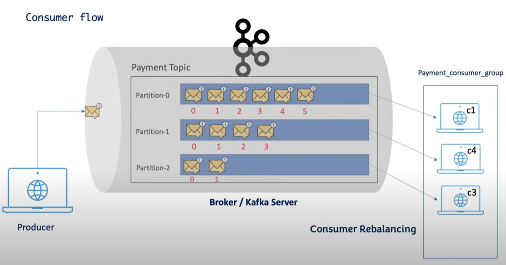
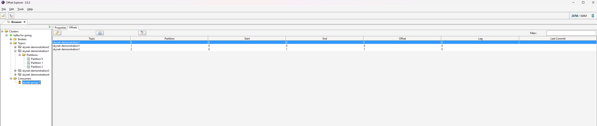

# Kafka spring boot application

## Producer Application using Kafka & Spring Boot

We start by defining the kafka connection for the producers:

    spring:
        kafka:
            producer:
                bootstrap-servers: localhost:29092

This way we can already send messages and spring-boot will create the 
topic for us. The problem in this case is that we cannot configure the topic 
so much, for example we cannot configure the partitions a topic can have.

So we have to define a topic configuration like the one defined in `KafkaTopicConfig`

    @Bean
    public NewTopic skynetDemonstration2() {
        return TopicBuilder.name("skynet-demonstration2")
            .replicas(1)
            .partitions(3)
            .build();
    }

But we still need to define the kafkaAdmin topic to configure the address successfully `KafkaConnConfig`

    @Bean
    public KafkaAdmin kafkaAdmin() {
        Map<String, Object> configs = new HashMap<>();
        configs.put(AdminClientConfig.BOOTSTRAP_SERVERS_CONFIG, "localhost:29092");
        return new KafkaAdmin(configs);
    }

When you send a message to a topic you cannot decide in which partition it goes. It is up to the kafka scheduler or Zookeeper
depending on which version you use.

## Consumer Application using Kafka & Spring Boot

The messages need to be consumed by a consumer. If we create a consumer, to listen to a default topic, so with 3 default partitions
this is not good for performance, so it's better to have 3 consumer for each partition. So we can create 3 consumer and then wrap them inside
a single consumer group. Consider that like we already saw adding a 4th consumer (in the same consumer group) won't help because it will simply
kept as a standby consumer and won't take into consideration until one of the previous consumer failed. THis concept is called *Consumer Rebalancing*.

So up until now the kafka flow should be something like this:

Consider that mapping a consumer to a consumer group is mandatory even if you have a single consumer

When you run your consumer application it shows
>> skynet-group-1: partitions assigned: [skynet-demonstration1-0, skynet-demonstration1-1, skynet-demonstration1-2]

Kafka shows you the partitions your consumer is assigned.
Consider that by default when you run your consumer, it will consumer only the message the comes, not the messages already present in the topic

So in this case you have the following situation in consumer group: skynet-group-1

### Kafka Consumer Scenario – Latest Offset Behavior

#### Step-by-step scenario

##### 1. Message in Partition 2 before consumer starts
- Partition 2 (`P2`) receives **1 message** at offset `0`.
- `End` for P2 becomes `1` (next offset to be written).
- The consumer starts **after** this message is written, with `auto.offset.reset=latest`.
- Kafka assigns the partition and **seeks to `End`** (position = 1).
- If `enable.auto.commit=true`, the consumer **commits offset 1** without reading offset 0.
- **Result:** the message at offset 0 is never consumed by this consumer group.

---

##### 2. Message in Partition 0 while consumer is active
- P0 gets a new message at the next available offset (e.g., `0`).
- The consumer is active, receives it immediately, processes it, and commits `Offset=1`.

---

##### 3. Stop consumer → add two messages in P0 → restart consumer
- While the consumer is stopped, P0 gets **two new messages** at offsets `1` and `2`.
- On restart, the consumer resumes from its **last committed offset** on P0 (which was 1).
- It consumes messages at offsets 1 and 2, then commits `Offset=3`.

---

#### Final table after all steps

| Partition | Start | End | Offset | Lag |
|-----------|-------|-----|--------|-----|
| 0         | 0     | 0   | 3      | 0   |
| 1         | 0     | 0   | 0      | 0   |
| 2         | 0     | 1   | 1      | 0   |

---

#### Why this happens

- **End** = next offset to be written (per partition).
- **Offset (group)** = committed position for the consumer group (last read + 1).
- With `latest` and **no saved offset**, the consumer **starts at `End`** → skips history.
- With `earliest` and **no saved offset**, the consumer **starts at `Start`** → reads all available history.

In this example:
- P0: fully consumed, hence `Lag=0` and `Offset=3End=0`.
- P2: the consumer was assigned after the message at offset 0 was already there, and with `latest` it skipped it, committing directly to offset 1.
- P1: empty.

N.B:
- `End` can be increased in certain version of kafka and the difference between `End` and `Offset` can represent the messages still need to be consumed
- `Start` can increase if the controller decides to delete certain messages

---

#### Key takeaways
1. **End** shows “tip of the log” for each partition.
2. **Offset (group)** shows where the consumer will start next time.
3. With `latest`, old messages are ignored if there is no previous committed offset.
4. To consume skipped messages, either:
    - Use a new `group.id`, or
    - Reset offsets for the existing group to `earliest`.